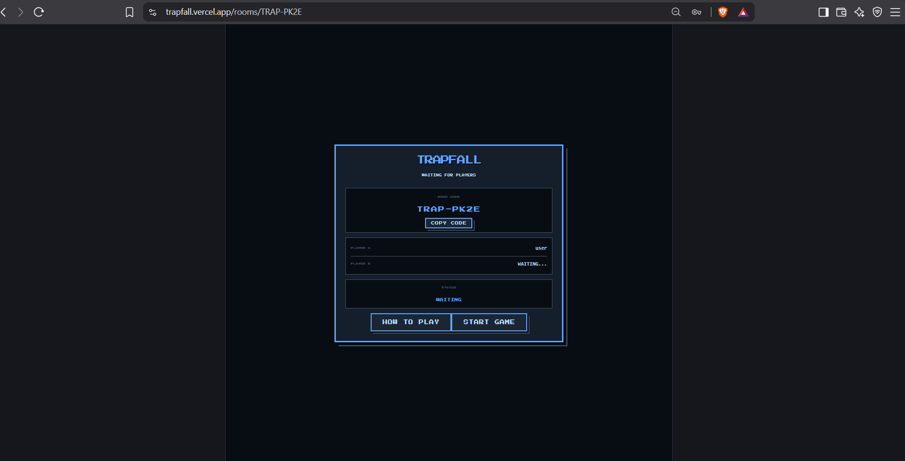
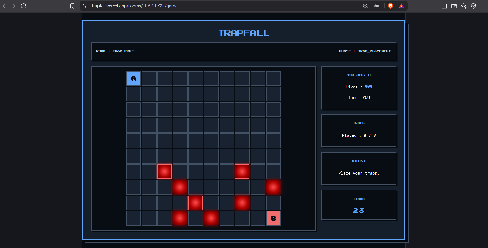

# TrapFall

TrapFall is a two-player browser-based strategy game built with React and FastAPI. Players create or join a room, place hidden traps, and then take turns moving across a 10×10 board while trying to reach the opponent's side.

The project was built to learn how a real-time multiplayer application works, including authentication, APIs, WebSockets, game state, PostgreSQL, migrations, and deployment.

### Screenshots

#### Lobby



#### Game



### How to Play

Create a room and share the room code with another player. Once both players are in the lobby, the game can be started.

Players first place their traps on the board. After the placement phase, traps are hidden and players take turns moving toward the opponent's side.

Stepping on a trap costs a life and moves the player backward two tiles. Losing all three lives eliminates the player. The first player to reach the opponent's side wins.

### Tech Stack

React, JavaScript, Vite, Python, FastAPI, WebSockets, SQLAlchemy, PostgreSQL, Alembic, JWT, and Argon2.

The frontend is deployed on Vercel and the backend/database are deployed on Railway.

### Testing

The backend has automated test coverage for authentication and room management, using pytest and FastAPI's TestClient.

- Register/login flows, including duplicate-registration and wrong-password handling
- Room creation and joining, using dependency overrides to simulate authenticated users

Tests run against a disposable PostgreSQL database, isolated from both development and production data.

### Running tests locally

```bash
pytest tests/ -v
```

Linting is handled with [ruff](https://docs.astral.sh/ruff/):

```bash
ruff check backend/
```

Both run automatically on every push and pull request via GitHub Actions.

### Current Features

Users can register and log in, create rooms, join rooms using a room code, play against another player, and reconnect to an existing room/game session.

The backend manages the game state while WebSockets are used for real-time lobby and game updates.

PostgreSQL stores persistent user data and Alembic is used for database migrations.

### Limitations

This is an MVP and is not production-ready.

There is currently no email ownership verification, password reset, proper server-side logout/token invalidation, matchmaking, rate limiting, or serious anti-cheat system.

Active rooms and games are currently stored in backend memory, so the application is not designed for multiple backend instances.

Reconnect handling is implemented, but disconnect and reconnect edge cases are still basic.

There may also be bugs that I have not discovered yet. Some edge cases, especially around WebSockets, simultaneous actions, and deployment/network conditions, have not been fully tested.


### Project Status

TrapFall is deployed and playable, but it is still an ongoing project. The goal was not to build a huge or highly polished game. I wanted to build something small enough to finish while getting hands-on experience with React, FastAPI, WebSockets, authentication, databases, real-time state, and deployment.

Future work will focus on improving reliability, handling edge cases, and addressing limitations as they are discovered.
